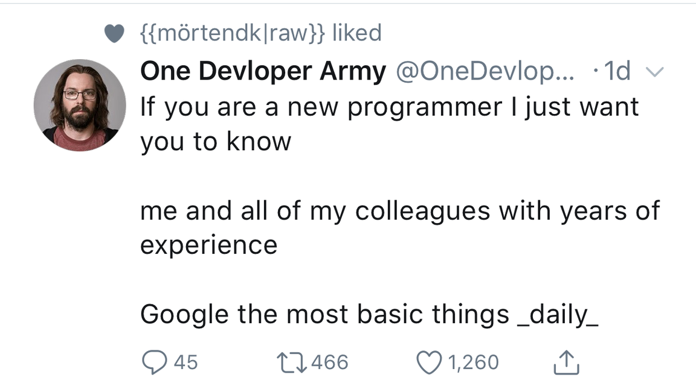

# New developer tips and tricks:
All of the things I wish I would have known as a intern.




## Terminal / Bash Profile happy fun times:
Often times this is not covered in schooling or is glanced over and can feel spooky. But really the terminal is only spooky if you run `sudo rm -rf /;` followed by your system password.

### So what is this thing bash?:

>(Bourne Again SHell shell) A command line processor for Unix from the Free Software Foundation. It is the de facto command processor in Linux and Mac. See Bourne shell and Free Software Foundation. 
source: [yourdictionary](http://www.yourdictionary.com/bash-shell)

### What can the terminal + bash profiles do?:
A LOT.

### What should I know to start?:
*(For this we are going to assume `.zshrc` file is used. For the most part the same can be applied to the `.bashrc` and `.bash_profile`).*

- Your `.zshrc` file lives in your `HOME (~/)` directory.
- After making edits to the `.zshrc` files you will need to run `source ~/.zshrc` in the terminal window. Also if you open a new terminal window you will automatically get the fresh changes.

### Editing my .zshrc file is a pain:
If you have to open a text editor and find your `.zshrc` file every time you want to make edits I would agree.

Luckily in bash we can create aliases for arbitrary commands. So for creating an alias to edit my `.zshrc` file I would create three aliases like this:

```
alias __open_vsc="open -a 'Visual Studio Code'"
alias __edit_zsh="__open_vsc ~/.zshrc"
alias __source_zsh="source ~/.zshrc"
```

- `__open_vsc` will open files / directories in `Visual Studio Code` ( This can be changed to Sublime, Atom, Dreamweaver (Please don't use Dreamweaver) ). 
- `__edit_zsh` will open your `.zshrc` file in `Visual Studio Code`
- `__source_zsh` will source your `.zshrc` file in the currently open & active terminal window

Then to use these commands in your terminal you would simply type the alias name (ex: `__edit_zsh`) and hit `enter`.

### My project requires me to run a bajillion commands, help?:
Rather than chaining a bunch of aliases together we can create `bash functions`. Much like functions in other programming languages they let us run a chunk of commands and pass in values.

A basic example to start up a rig project:

```
# Start the outrigger and project box.
startup() {
  rig start;
  eval "$(rig config)";
  docker-compose up -d;
}
```

And to use this we would simply type `startup` and hit enter. Note, the `()` at the end of `startup` is not needed.

For a more complex function we could do something like this:

```
# Get environment URL
#$1 country code
#$1 environment code
open-site() {
  if [ $2 == 'local' ]; then
    open http://$1.cool-project.vm/
  else
    open http://$1.$2.cool-project.com/
  fi
}
```

Which to use this would be something like `open-site us local` and it would produce a url like: `http://us.cool-project.com`. If we did `open-site us dev` it would give us a URL like `http://us.dev.cool-project.com`.

***Note:** If your variable contains spaces wrap it in double quotes.*

### I wish I could see all of the files, directories, and hidden goodies:
You can by running `ls -lah` or if you are on [zsh](https://ohmyz.sh/) or alias it, the command is simply `ll`.

### I was trying to do this thing with a long command but now I need sudo.:
Cake, run `sudo !!` and you will be prompted to run your last command with sudo in front. In fact you can put anything in front of the `!!` (Bang Bang), it just simply tells the terminal you want the previous run command.

### So I ran a thing like 3 commands ago.:
Super cake, hit the up arrow 3 times to get back to that commands.

The up arrow will start to cycle through previously run commands.

### So I ran this command like 5 minutes ago and I need to run it again.:
Less cake, still easy.
- Hold `CTRL+r`, this will bring up a prompt 
- Start typing the command and when what you want appears hit enter

### So I ran the wrong script and it is chugging away.:
Hold `CTRL + c` and 9 times out of 10 every time it will eject you out.

### Someone told me to try vim, how do I exit?:
- Hit `ESC`
- Type `:q!` to quit, `:wq` to save changes and quit

### What is this Tmux?:
Tmux is a screen multiplexer which is fancy words for it splits your terminal window into multiple working areas. [Hacker Noon](https://hackernoon.com/a-gentle-introduction-to-tmux-8d784c404340) has a great write up on how to get tmux up and running. 

### Why not just use Iterm2? it's awesome and I can split up my working area into panes.:
Iterm2 is for sure awesome and I use it daily, but not to split up my working space. Soon as Iterm2 crashes or I decide I want to use another terminal such as the built in one for VS Code I have a lot of overhead to get back into a productive state.

Tmux run as a independent process. What this means is, unless tmux crashes it doesn't matter if you switch terminals or your terminal crashes as long as that tmux process remains running. 

### How can I make Tmux more awesome?:
Tmux allows for custom config and great starting place is this [repo](https://github.com/gpakosz/.tmux) and following the install instructions.

Some of the allowed options are as follows:
- Clicking to switch panes
- Custom themes
- Stats such as how much battery life is left, computer uptime, branch name
- And many more


## The not so devy skills:
As unfortunate as it may be as a developer our day will involve more than just heads down and coding up work. Sometimes these non dev skills come into a bigger play and are more important than your dev chops.

### I don't want to look dumb but I don't know how go about working on this ticket.:
REACH OUT AND ASK SOMEONE!

Seriously, if you have spent a fair chunk of time trying to solve an issue but are making no progress reach out. If you are shy reaching out to the team then reach out to someone directly. It is always better to ask someone for help than waste loads of time going nowhere. 

Also, if you have a solution for a ticket but are not 100% it is the correct / intended / best approach also reach out to the lead on the project. Collaboration on work overall saves time, the client money, and makes everyone in the end happy.


### What are Timesheets and this thing called Standup?:
In order to get paid we need to record time and what we were doing with that time. In my opinion one of the best ways to record time is a site / app called [Toggl](https://toggl.com/). You can start / stop time entries, add notes, see reports, the list goes on. 

For timesheets it's a bit more difficult to copy / paste what you did out multiple time entry notes. Also trying to quickly comb through multiple entries to tell your teammates in standup what you have been working on and what you plan on working on more than likely won't work to well. So for this I would highly recommend using a app to take notes and create a system for this. Some apps include Evernote (I personally use this) and Google Keep. Both of these are great options for taking daily task notes and creating a system that works for you.

### Man, the things that come out of my mouth surprise me sometimes.:
In a normal setting this for the most part is no big deal, but for with colleges and clients this can get cringy extremely fast. I know from experience that blurting things out doesn't always go well. Instead taking a second or two and thinking before talking can help immensely.

### *"I didn't know that was a thing..."*:
9 out of 10 times this is never the right answer to a client question. Trust me, I also know this from experience. 

If a client asks you a question that catches you off guard or you really don't know the answer to it phrase a response someone along the likes of `"I will need to look further into that and I can get back to you shortly with a answer."` or something that is reassuring to the client and lets them know that even if you don't have a answer you will be sure and get them one.

